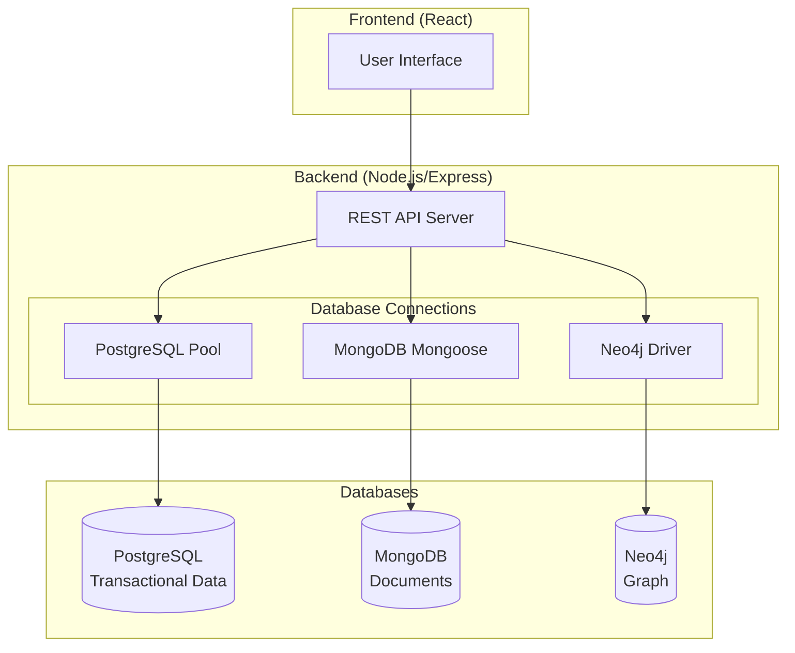

# RescueNet Multi-Database Architecture

## Overview

RescueNet uses a **polyglot persistence** strategy with three different database technologies, each handling specific types of data:



---

## Database Responsibilities

### 1. PostgreSQL (Transactional Data)
**Purpose**: Core structured data with ACID compliance and complex business logic

| Table | Description |
|-------|-------------|
| `users` | User accounts and authentication |
| `disaster_zones` | Disaster area definitions |
| `shelters` | Shelter locations and capacity |
| `resource_centers` | Supply warehouse info |
| `resources` | Resource types catalog |
| `inventories` | Current stock levels |
| `rescue_teams` | Team information |
| `team_members` | Team membership |
| `vehicles` | Vehicle registry |
| `citizen_requests` | Help requests |
| `team_assignments` | Task assignments |
| `audit_log` | Change tracking |

**PL/SQL Features**:
- **Stored Procedures**: `assign_team_to_request()`, `allocate_resources()`, `resolve_request()`
- **Functions**: `get_available_capacity()`, `get_zone_statistics()`, `get_team_workload()`
- **Triggers**: Auto-audit logging, inventory threshold alerts, capacity validation

---

### 2. MongoDB (Semi-Structured Documents)
**Purpose**: Flexible schemas for varying document structures

| Collection | Description |
|------------|-------------|
| `disasterreports` | Incident reports with flexible fields per disaster type |
| `resourcerequests` | Resource requests with varying requirements |
| `users` | User profiles with authentication |
| `disasterzones` | Zone data (mirror for quick access) |

**Features**:
- Flexible schema for different disaster types
- Embedded documents for related data
- Aggregation pipelines for analytics

---

### 3. Neo4j (Graph Relationships)
**Purpose**: Relationship analysis and network queries

| Node Type | Relationships |
|-----------|---------------|
| `User` | `:LEADS`, `:MEMBER_OF`, `:SUPERVISES` |
| `Team` | `:ASSIGNED_TO`, `:BASED_AT`, `:COORDINATES_WITH` |
| `Zone` | (target of assignments) |
| `ResourceCenter` | `:SUPPLIES` |
| `Shelter` | `:LOCATED_IN` |

**Graph Queries**:
- Team collaboration networks
- Resource flow tracking
- Shortest path analysis
- Hub detection (most connected entities)

---

## API Endpoints

### PostgreSQL Routes (`/api/pg/`)
| Endpoint | Method | Description |
|----------|--------|-------------|
| `/users` | GET | List all users |
| `/zones` | GET | List disaster zones |
| `/assign-team` | POST | Call PL/SQL procedure |
| `/allocate-resources` | POST | Call PL/SQL procedure |
| `/zone-capacity/:id` | GET | Get shelter capacity |
| `/zone-stats/:id` | GET | Get zone statistics |
| `/team-workload` | GET | Get team workload report |
| `/inventory-status` | GET | Get inventory with alerts |
| `/init` | POST | Initialize database |
| `/seed` | POST | Seed with sample data |

### Neo4j Routes (`/api/graph/`)
| Endpoint | Method | Description |
|----------|--------|-------------|
| `/team-collaboration` | GET | Team coordination network |
| `/user-network` | GET | User relationships |
| `/resource-flow` | GET | Resource distribution |
| `/zone-overview` | GET | Zone with all relationships |
| `/critical-zones` | GET | Under-resourced zones |
| `/shortest-path` | GET | Path between entities |
| `/most-connected` | GET | Hub analysis |
| `/init` | POST | Initialize graph schema |
| `/seed` | POST | Seed with sample data |

### MongoDB Routes (`/api/`)
- `/disaster-reports` - Disaster report CRUD
- `/resource-requests` - Resource request CRUD
- `/zones`, `/shelters`, `/resources`, etc. - Existing routes

---

## Setup Instructions

### 1. PostgreSQL Setup
```bash
# Create database
psql -U postgres -c "CREATE DATABASE rescuenet;"

# Update .env with your credentials
POSTGRES_HOST=localhost
POSTGRES_PORT=5432
POSTGRES_DB=rescuenet
POSTGRES_USER=postgres
POSTGRES_PASSWORD=your_password

# Initialize via API
POST http://localhost:5000/api/pg/init
POST http://localhost:5000/api/pg/seed
```

### 2. Neo4j Setup
See [NEO4J_INSTALLATION.md](./NEO4J_INSTALLATION.md) for installation guide.

```bash
# Update .env
NEO4J_URI=bolt://localhost:7687
NEO4J_USER=neo4j
NEO4J_PASSWORD=rescuenet123

# Initialize via API
POST http://localhost:5000/api/graph/init
POST http://localhost:5000/api/graph/seed
```

### 3. MongoDB Setup
```bash
# Already configured, ensure MongoDB is running
MONGODB_URI=mongodb://localhost:27017/disaster_management
```

### 4. Install Dependencies & Run
```bash
cd backend
npm install
npm run dev
```

---

## Health Check

Check all database connections:
```
GET http://localhost:5000/api/health
```

Response shows status of all three databases.
